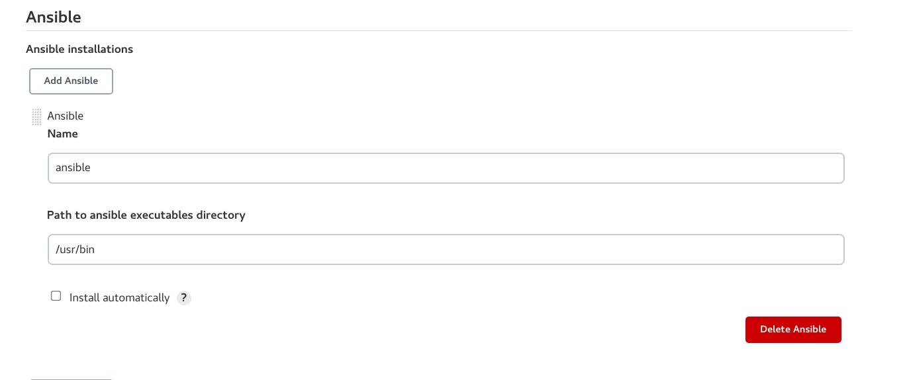
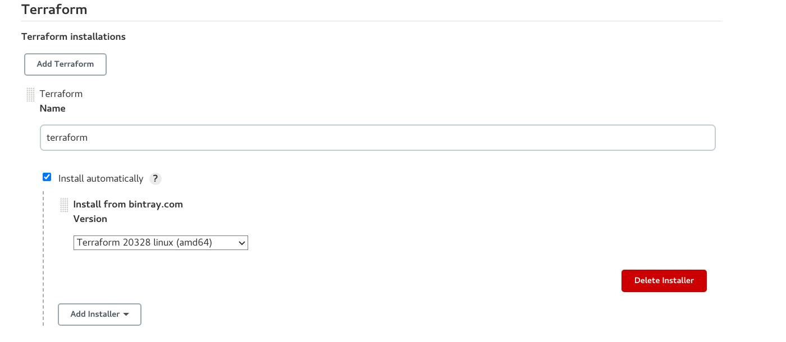
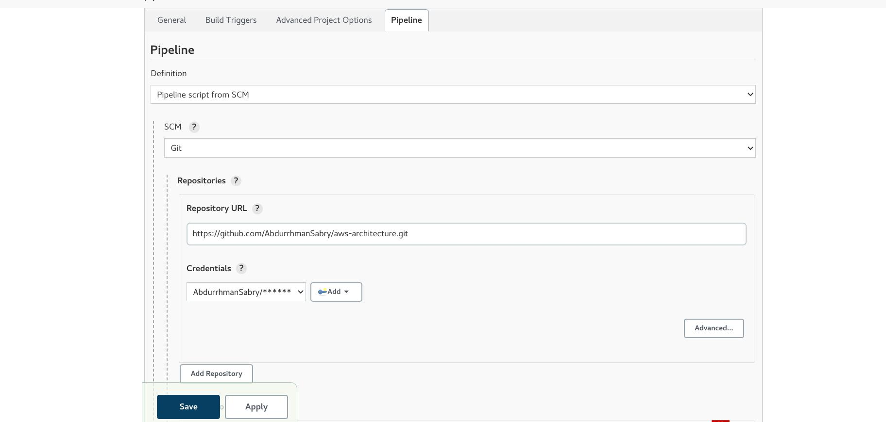
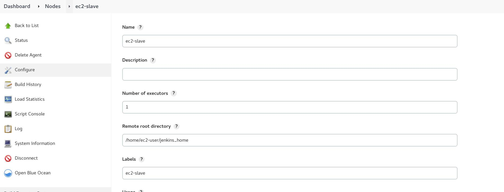
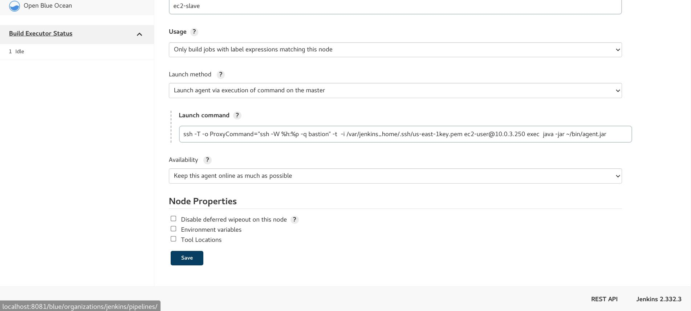
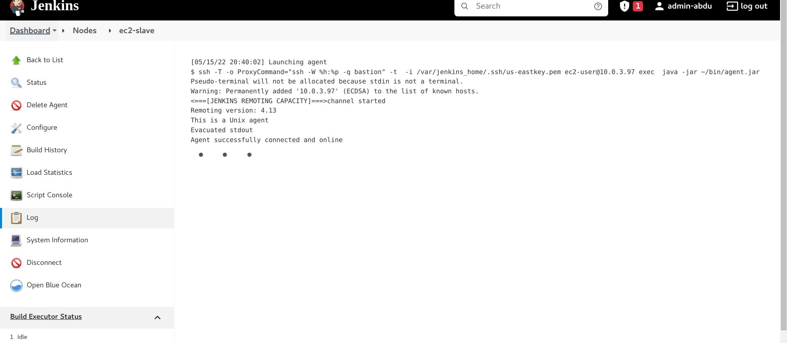
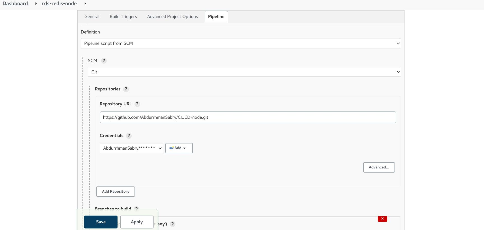
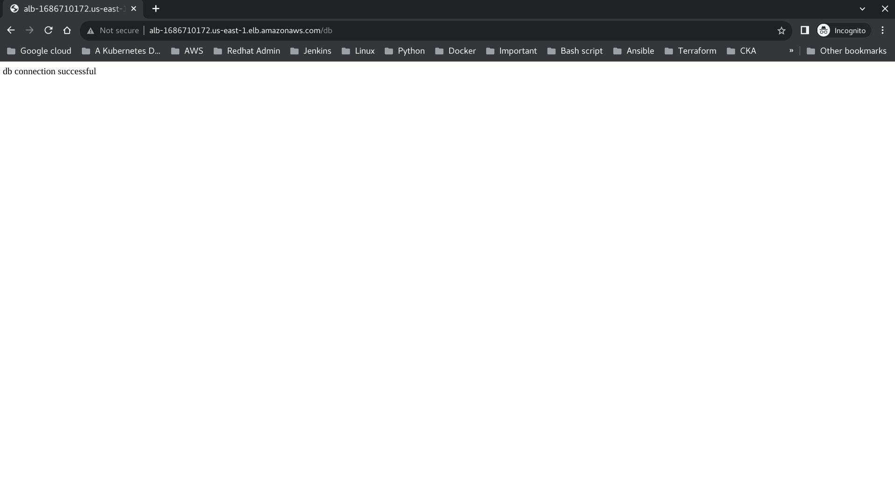

# Provisioning and Configuring Infrastucture on AWS Using Jenkins Pipeline
## Project Info
This code is used to provision and configure an infrasturcture on AWS.

## The architecture


### Tools Used

1. Terraform 
2. Ansible 
3. Jenkins 
4. Docker  
5. AWS  

### Preparing Jenkins  master
1. Clone The repo
```bash
git clone https://github.com/AbdurrhmanSabry/aws-architecture.git
```

2. Build the Dockerfile of Jenkins:
```bash
docker build -t abdurrhmansm/jenkins_master -f Dockerfile .
```
3. Run a docker container of the built image:
```bash
docker run -it -d -v /var/run/docker.sock:/var/run/docker.sock -v jenkins-data:/var/jenkins_home  -p 8081:8080 abdurrhmansm/jenkins_master
```
4. Access the Jenkins server on http://localhost:8081 through the browser, install the required plugins and additionally install the following plugins:\
a. Cloudbees AWS  credentials\
b. pipeline AWS Steps\
c. Ansible\
d. Terraform 

5. Add Global configuration for Ansible and Terraform\
Ansible


Terraform



6. In Manage Credentials, add credentials for\
    a. Dockerhub: username and password \
    b. Github: username and password(access token)\
    c. Ansible: Private Key to access instances named ansible-us-east\
    d. AWS: Of type Aws credentials

7. Terraform requires:\
a. S3 bucket in us-east-1 and add its name in terraform/backend\
b. Create Dynamodb table named state-lock. The table must have a partition key named LockID with type of String.\
c. Create IAM user with programmatic access add the access key for that user in the aforementioned AWS credentials.\
d. Optional, You can set the variables in the dev.tfvars file. Push any change you make.
8. SSH configuration for Ansible and Jenkins Slave:\
The Jenkins server to have the following:\
a. SSH config:
```bash
# Access the container
docker exec -it 89903b64d800 /bin/bash
mkdir /var/jenkins_home/.ssh
touch /var/jenkins_home/.ssh/config
vi /var/jenkins_home/.ssh/config
# ADD the following in the file
Host *
    Port 22
    StrictHostKeyChecking no
    UserKnownHostsFile /dev/null
    ServerAliveInterval 60
    ServerAliveCountMax 30

Host bastion
    HostName ip
    User ec2-user
    IdentityFile ~/.ssh/privateKey.pem
# To save press ZZ
# exit the container
exit 

# Copy the private key
docker cp ./privateKey.pem 89903b64d800:/var/jenkins_home/.ssh

# access the container as root
docker exec -it -u root 89903b64d800 /bin/bash
service ssh start
apt-get install ansible 
chmod 400 /var/jenkins_home/.ssh/privateKey.pem
```
### Creating the Infrastructures
1. Create a new Item of type pipeline, add the repo link in the repository link



2. Build the Pipeline
3. ADD the private EC2 as a slave for Jenkins
In Launch method, Choose Launch agent via execution of a command on the master. In Lasunch command, Write the following command.
``` bash
ssh -T -o ProxyCommand="ssh -W %h:%p -q bastion" -t  -i /var/jenkins_home/.ssh/privatekey.pem ec2-user@private_ip of instance exec  java -jar ~/bin/agent.jar
```



Save and Launch the agent. Wait until the following message is shown to you




4. After it finishes, fork the following repo:
https://github.com/AbdurrhmanSabry/CI_CD-node.git

5. Clone The repo
```bash
git clone https://github.com/AbdurrhmanSabry/CI_CD-node.git
```
6. Add the RDS endpoint and the elasticache redis endpoint in the Jenkinsfile and push it to the repo. In Jenkins add the RDS credentials  and name RDS_CRED
7. Create another pipeline and add the CI/CD repo in the repository link



8. Build the pipeline

### Access the App deployed in EC2 Through ALB

The result should look like this




